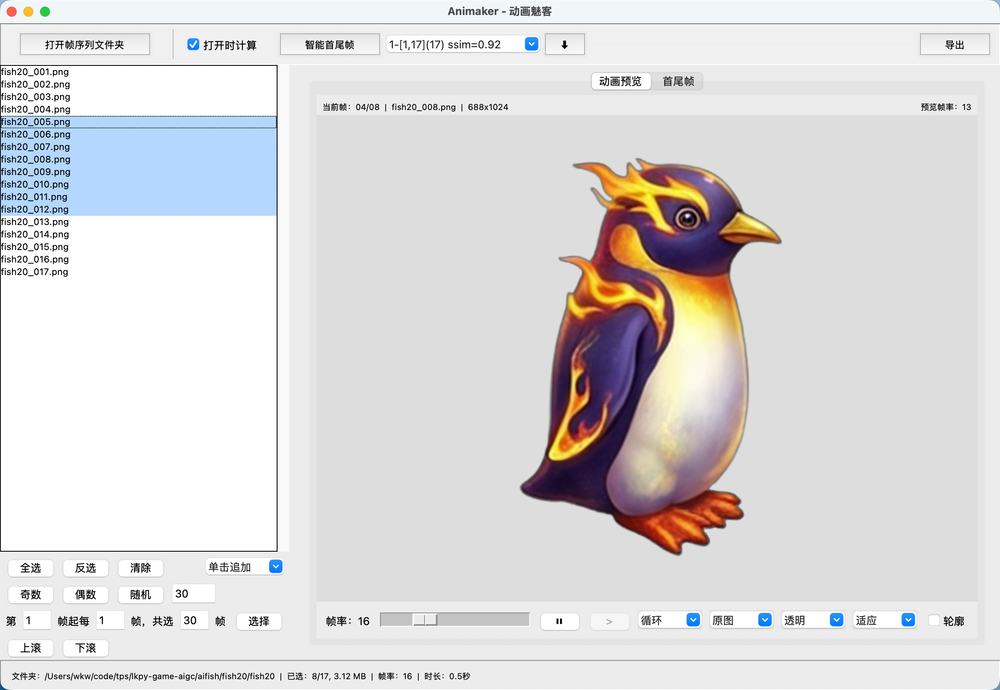

# Animaker 动画魅客

Animaker 动画魅客是一款面向序列帧的本地可视化工具，用于高效挑选、预览和打包导出游戏/动画帧资源。



## 关于 AI vibe coding

本项目从需求整理、技术选型到功能设计与实现，完整采用 AI 辅助的 vibe coding 方式推进：通过在 `spec.md` 中逐步迭代需求与细节，再由 AI 生成与修订代码，实现了几乎全程「对话驱动开发」。你可以将 `spec.md` 视作本项目的「设计蓝本」，其中记录了功能目标、交互细节以及若干实现思路，代码则是在这一蓝本的基础上由 AI 持续补全与打磨。

## 前置要求

- Python >= 3.11
- [uv](https://github.com/astral-sh/uv)
- [just](https://github.com/casey/just)

## 安装

```bash
just install        # 安装依赖
just install-dev    # 安装开发依赖
```

## 使用

运行 GUI：

```bash
uv run animaker
# 或
just run
```

主要功能：

- 序列帧浏览与多选：按文件名排序，支持区间筛选、奇偶/随机选择、上/下滚微调。
- 实时动画预览：可调帧率，循环/单次播放，多种背景与缩放模式，支持轮廓/黑白对比。
- 智能首尾帧：基于结构相似度推荐可循环区间，一键选中并预览差异/叠加效果。
- 导出与打包：将选中帧打包为 ZIP，可重命名帧、生成 GIF，并输出 Phaser 动画 JSON 定义。
- 动画数据合并：批量扫描或导入 JSON 动画配置，一键合并为统一的 anims 配置文件。

